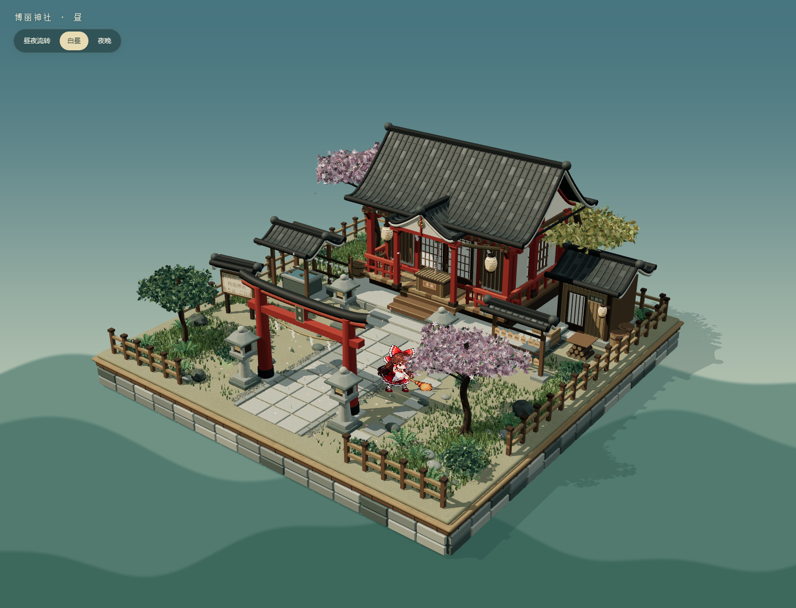
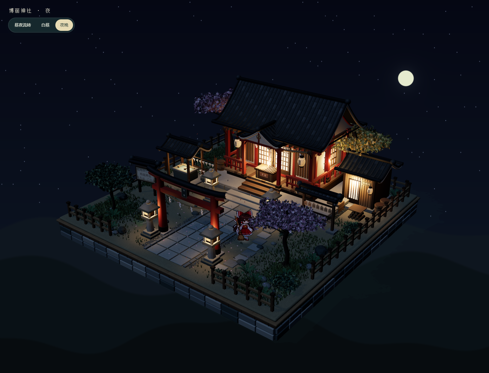

# Three.js Scenes

独立的 Three.js 三维场景作品集，用来持续收纳不同人物、建筑与世界的小型交互场景。

每个场景都保留可运行源码、素材来源、完整制作提示词、预览与独立的运行方式。场景之间不共享易相互影响的全局依赖，后续可以直接新增同级目录。

## 场景目录

| 场景 | 内容 | 制作提示词 |
| --- | --- | --- |
| [博丽神社 · 幻想乡庭院](hakurei-shrine/) | 半写实三渲二神社、昼夜切换、茂密庭院、像素灵梦扫地与跳跃 | [完整复刻提示词](hakurei-shrine/RECREATE_PROMPT.md) |





## 不用命令，直接体验

在仓库的 **Releases** 中下载「博丽神社-双击即看.zip」，解压后双击 **双击打开博丽神社.html**。使用较新的 Edge 或 Chrome 即可，不需要安装依赖，也不需要联网。

直接下载源码时，各场景的 `offline/` 目录也包含可独立打开的 HTML。GitHub 的文件预览页不会直接运行 HTML，需要先下载到电脑。

## 继续开发

进入对应场景目录，按场景 README 运行。例如：

```sh
cd hakurei-shrine
npm ci
npm run dev
```

博丽神社支持 `npm run build` 生成普通网页、`npm run build:offline` 生成单文件离线版。浏览器验证运行 `npx playwright test`，默认需要本机 Microsoft Edge。

## 添加新场景

参考 [新场景约定](SCENES.md)。每个新场景使用独立同级子目录，并在上面的目录表登记。

```text
threejs-scenes/
├─ README.md
├─ SCENES.md
├─ hakurei-shrine/
│  ├─ src/                    # 场景及动画
│  ├─ public/assets/          # 随项目保存的素材与出处
│  ├─ previews/               # 当前版本的截图 / 动作预览
│  ├─ offline/                # 可双击的离线版本
│  ├─ scripts/                # 构建与预览工具
│  ├─ tests/
│  ├─ RECREATE_PROMPT.md      # 无需聊天历史的完整制作提示词
│  └─ README.md
└─ another-scene/             # 后续场景同级添加
```

## 素材说明

本仓库保存场景实现与制作记录。人物、作品名称及第三方素材涉及的权利归各自权利人；素材生成方式与底稿说明见各场景的素材目录。当前未为整个仓库指定统一的开源许可证。
