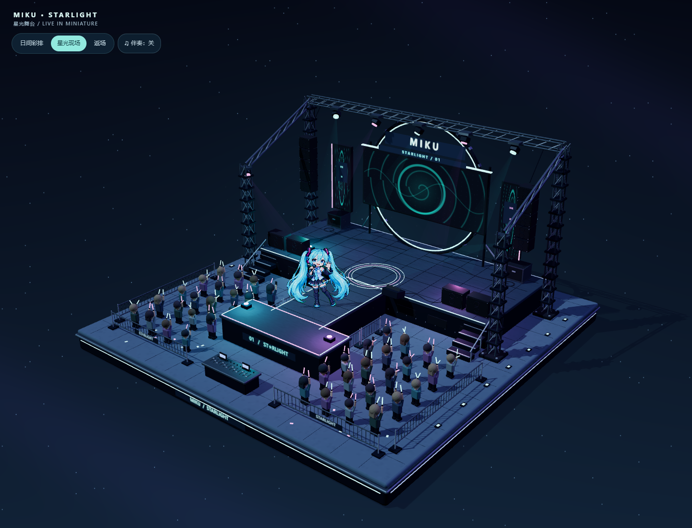

# MIKU · STARLIGHT — 初音未来星光演唱会

以初音未来为主角的半写实三渲二微缩舞台。青绿、紫粉灯光与星空背景包围完整方形底座，环形主屏、金属桁架、T 台和荧光棒观众组成一场可近看、可旋转的小型演出。



## 直接打开

下载 Release 中的 **初音未来-星光演唱会-双击即看.zip**，解压后双击 **双击打开初音星光演唱会.html**。源码中的 `offline/` 目录也提供同一文件。无需命令、依赖安装或联网，建议使用较新的 Edge / Chrome。

- 拖动旋转，滚轮或双指缩放。
- 左上角切换「日间彩排 / 星光现场 / 返场」。
- 伴奏默认关闭，手动开启后播放本地合成的原创 112 BPM 电子器乐伴奏，无外部歌曲或人声采样。

## 场景与动作

- 分层金属底座、主舞台、T 形延伸台、发光包边与细分台面。
- 四弦桁架、对角支撑、灯具挂架、螺栓、线阵音箱、低音箱、监听音箱、航空箱、卷线、地线和控台。
- 动态环形 LED 画面、三块舞台屏、缓慢扫动的灯束、局部彩色照明；返场时转为更多紫粉色并增加彩纸。
- 40 位简化三维观众挥动荧光棒，部分观众举起手机。
- 初音使用图像生成的独立 12 姿态图集：演唱、伸手、抬臂、舞步、小跳、落地、观众互动和谢幕。双马尾随姿态改变，不使用整图扭曲假装动作。
- 人物会从主舞台沿 T 台走向观众区，脚底与舞台高度对齐；小跳的地面阴影留在台面并随高度变淡、变大。

动作视频见 `previews/performance.webm`。人物与动作生成提示词见 `public/assets/miku/PROVENANCE.md`，完整从零制作提示词见 [RECREATE_PROMPT.md](RECREATE_PROMPT.md)。

## 开发

```sh
npm ci
npm run dev
```

默认地址为 `http://localhost:5174`，与博丽神社的开发端口独立。

```sh
npm run build
npm run build:offline
npm test
```

测试默认使用 Microsoft Edge，涵盖旋转缩放、12 姿态、台面路径、落地高度、模式切换、伴奏开关与 `file://` 断网运行。离线测试前请先生成离线版。录制动作预览使用 `node scripts/record-preview.mjs`，需要 Playwright FFmpeg 组件。

## 结构

| 文件 | 内容 |
| --- | --- |
| `src/main.js` | 舞台建筑、设备与场景初始化 |
| `src/geometry.js` | 建模工具与静态几何合并 |
| `src/anime-material.js` | 半写实三渲二材质 |
| `src/show.js` | 屏幕、灯光、模式 UI、彩纸 |
| `src/performer.js` | 色键导入、姿态、舞步与台面位置 |
| `src/audience.js` | 观众与荧光棒动作、控台 |
| `src/sound.js` | 手动启用的原创合成器伴奏 |
| `scripts/build-offline.mjs` | 将程序、人物素材嵌入单文件 HTML |

所有运行必需素材随项目保存。场景不依赖外部模型、图片、字体或音乐服务。
